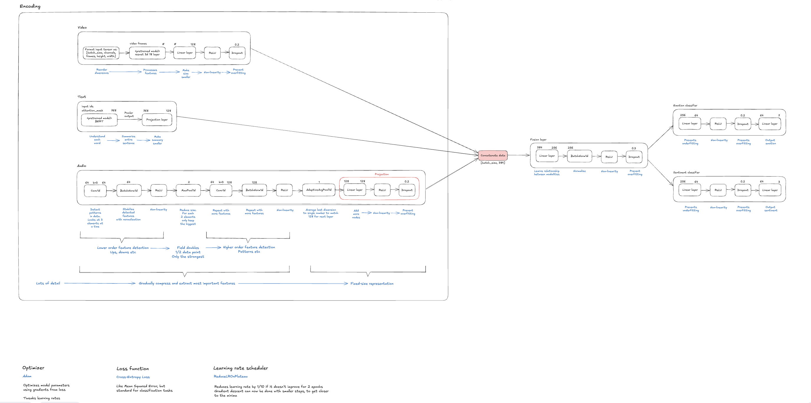

# Multimodal Emotion Analyzer with Video, Text, and Voice

A comprehensive SaaS platform for analyzing emotions and sentiments in videos using a multimodal deep learning approach. This project combines video frame analysis, audio processing, and text transcription to provide accurate emotion and sentiment detection.



## 📋 Table of Contents

- [Overview](#overview)
- [Features](#features)
- [Project Structure](#project-structure)
- [Model Architecture](#model-architecture)
- [SaaS Platform](#saas-platform)
- [Setup and Installation](#setup-and-installation)
- [Training the Model](#training-the-model)
- [Deploying the Model](#deploying-the-model)
- [API Usage](#api-usage)
- [Technologies Used](#technologies-used)
- [License](#license)

## 🔍 Overview

This project is a complete end-to-end solution for video sentiment analysis. It consists of two main components:

1. **AI Model Component**: A multimodal deep learning model that processes video, audio, and text to detect emotions and sentiments.
2. **SaaS Web Application**: A web platform that allows users to upload videos, analyze them using the trained model, and view detailed results.

The system extracts frames from videos, transcribes speech, and analyzes audio patterns to provide comprehensive emotional analysis with high accuracy.

## ✨ Features

### ML Model Features
- 🎥 Video frame extraction and analysis
- 🎙️ Audio feature extraction using mel spectrograms
- 📝 Text embedding with BERT
- 🔗 Multimodal fusion of video, audio, and text features
- 📊 Emotion classification (anger, disgust, fear, joy, neutral, sadness, surprise)
- 💭 Sentiment classification (positive, negative, neutral)
- 📈 TensorBoard logging for model training visualization
- 🚀 Model training and evaluation pipeline

### SaaS Platform Features
- 🔐 User authentication with Auth.js
- 🔑 API key management for secure access
- 📊 Usage quota tracking for API requests
- 🚀 Video upload and processing
- 📈 Real-time analysis results with confidence scores
- 🎨 Modern UI with Tailwind CSS
- 📱 Responsive design for all devices
- 📄 API documentation and code examples

## 📁 Project Structure

The project is organized into two main directories:

```plaintext
ai-video-sentiment-saas/
├── ai-video-sentiment-model/     # ML model component
│   ├── dataset/                  # MELD dataset and preprocessing
│   ├── deployment/               # Model deployment scripts
│   │   ├── models.py             # Model architecture for inference
│   │   ├── inference.py          # Inference pipeline
│   │   ├── deploy_endpoint.py    # Endpoint deployment script
│   │   └── requirements.txt      # Deployment dependencies
│   └── training/                 # Model training scripts
│       ├── models.py             # Model architecture definition
│       ├── meld_dataset.py       # Dataset loader
│       ├── train.py              # Training script
│       └── requirements.txt      # Training dependencies
├── prisma/                       # Database schema and migrations
├── public/                       # Static assets
├── src/                          # SaaS web application
│   ├── actions/                  # Server actions
│   ├── app/                      # Next.js app router
│   ├── components/               # React components
│   ├── lib/                      # Utility functions
│   ├── schemas/                  # Validation schemas
│   ├── server/                   # Server-side code
│   └── styles/                   # CSS styles
└── Model_Working.png             # Model architecture diagram

## 🧠 Model Architecture


The diagram above illustrates our multimodal approach to emotion and sentiment analysis. The architecture consists of three parallel encoding pathways (video, text, audio) that are later fused to make predictions.

### Encoding Pathways

#### 1. Video Encoder

- **Input**: Extracts 30 frames from each video clip
- **Processing**: Uses a 3D ResNet (R3D-18) pretrained on action recognition
- **Feature Extraction**: Processes frames through convolutional layers to capture spatial and temporal patterns
- **Output**: Produces a 128-dimensional feature vector representing visual emotional cues


#### 2. Text Encoder

- **Input**: Transcribed speech from the video
- **Processing**: Uses BERT (bert-base-uncased) for contextual word embeddings
- **Feature Extraction**: The [CLS] token embedding captures sentence-level semantics
- **Output**: Projects to a 128-dimensional feature vector representing linguistic emotional cues


#### 3. Audio Encoder

- **Input**: Mel spectrograms extracted from the audio track
- **Processing**: Multi-stage convolutional network with batch normalization
- **Feature Extraction**:

- Lower-level features: Captures tone, pitch, and rhythm
- Higher-level features: Identifies patterns like stress and intonation


- **Output**: Projects to a 128-dimensional feature vector representing acoustic emotional cues


### Fusion and Classification

- **Feature Fusion**: Concatenates the three 128-dimensional vectors into a 384-dimensional multimodal representation
- **Fusion Layer**: Processes the concatenated features through a fully connected layer with batch normalization (256 neurons)
- **Classification Heads**:

- **Emotion Classifier**: Predicts 7 emotion classes (anger, disgust, fear, joy, neutral, sadness, surprise)
- **Sentiment Classifier**: Predicts 3 sentiment classes (positive, negative, neutral)


### Training Components

As shown in the bottom part of the diagram:

- **Optimizer**: Adam optimizer with different learning rates for each component
- **Loss Function**: Cross-entropy loss with label smoothing for both emotion and sentiment tasks
- **Learning Rate Scheduler**: ReduceLROnPlateau that reduces learning rate when validation metrics plateau


This architecture effectively combines visual, linguistic, and acoustic information to provide a comprehensive analysis of emotions and sentiments in video content.

### Training Details

- Uses weighted cross-entropy loss with label smoothing
- Adam optimizer with different learning rates for each component
- ReduceLROnPlateau scheduler for adaptive learning rate
- Trained on the MELD dataset (Multimodal EmotionLines Dataset)
- Evaluation metrics: precision, accuracy for both emotion and sentiment


## 💻 SaaS Platform

The SaaS platform provides a user-friendly interface for accessing the video sentiment analysis capabilities:

### Authentication System

- Email/password registration and login
- Secure password hashing with bcrypt
- JWT-based session management with Auth.js


### API Key Management

- Automatic API key generation for each user
- Secure key storage and validation
- Usage tracking and quota enforcement


### Video Processing Pipeline

1. User uploads a video through the web interface or API
2. Video is stored securely in cloud storage
3. System generates a signed URL for the video
4. Model processes the video, extracting frames, audio, and text
5. Results are returned with detailed emotion and sentiment analysis


### Dashboard Features

- Real-time analysis results visualization
- Emotion and sentiment confidence scores
- Utterance-level breakdown of emotions and sentiments
- API usage statistics and quota monitoring
- Code examples for API integration


## 🚀 Setup and Installation

### Prerequisites

- Node.js 18+ and npm
- Python 3.9+
- AWS account (for model deployment)
- PostgreSQL or SQLite database